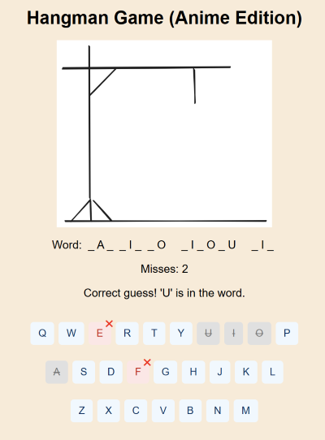
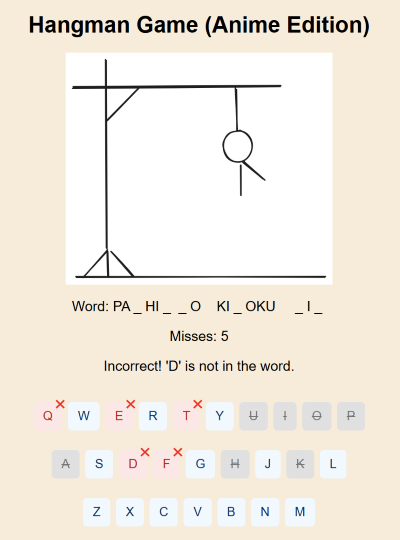

# Hangman Game (Anime Edition) 

Ready to test your anime knowledge and your letter-guessing skills? 
This Hangman game throws random anime titles your way — no boring words here!  

Miss too many guesses, and the hangman’s coming for you (No pressure).

---

## Why play this game?  

- You will discover new anime titles you,ve never heard of before.
- It’s the perfect excuse to procrastinate but still feel productive.  
- You get to see cool anime art without hunting for it on Google.  

---

### When you start, full of hope

### That glorious moment when you guess right

### When you realize you’re terrible at guessing letters

### The hangman finally gets you 😭

## Setup

1. Create and activate a virtual environment.
2. Install dependencies: `pip install -r requirements.txt`
3. Run the app: `python app.py`
4. Open http://127.0.0.1:5000 in your browser.gut 